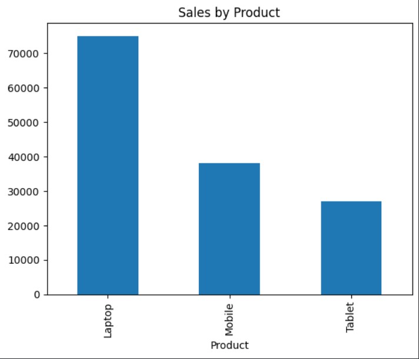

# 📊 Task 5 – Data Analysis on CSV Files

## Objective
Analyze sales data from a CSV file using Python Pandas and create basic visualizations.

## Tools Used
- Python
- Pandas
- Matplotlib
- Google Colab 

## Work Done
- Loaded CSV file using Pandas
- Checked dataset using info(), describe(), shape
- Grouped sales data by product
- Calculated total sales
- Created bar chart visualization

## Output
Sales analysis with chart showing product-wise sales.

## Files Included
- analysis.ipynb → Notebook code
- sales.csv → Dataset
- screenshot.jpg → Chart output

## Screenshot

